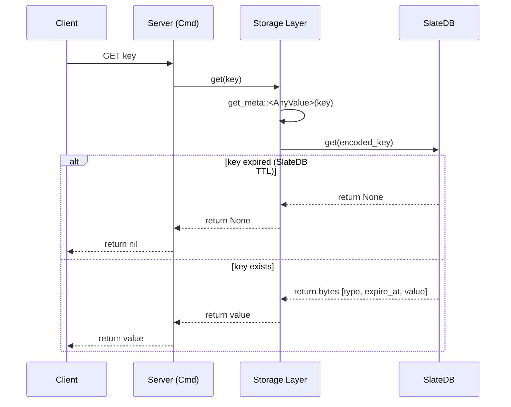

# Storage Design

This document describes the complete design and implementation of Nimbis's storage layer, including the SlateDB backend, Redis data type implementation, versioning mechanism, and TTL implementation.

## Table of Contents
1. [SlateDB Redis Data Types Implementation](#slatedb-redis-data-types-implementation)
2. [Storage Architecture](#storage-architecture)
3. [Storage Version Design](#storage-version-design)
4. [TTL and Expiration Implementation](#ttl-and-expiration-implementation)

---

## SlateDB Redis Data Types Implementation

### Overview

SlateDB is a key-value store. To support Redis data types (String, Hash, List, Set, ZSet), we use a multi-engine architecture where each data type is stored in its own dedicated SlateDB instance. This provides isolation and simplifies key management by removing the need for type prefixes in keys.

### Storage Architecture

We maintain separate SlateDB instances for:
- **String (and Meta)**: Stores String values and Metadata for other types (Hash, List, Set, ZSet)
- **Hash**: Hash fields storage
- **List**: List elements storage
- **Set**: Set members storage
- **ZSet**: Sorted Set members and score indices storage

Each supported data type has a **Type Code** stored in the `String DB` key-value pair to identify the type and allow collision detection.

### Encoding Scheme

#### 1. Root Key (in String DB)

All keys start in the `String DB`, which acts as the source of truth for the key's type.

**Key Format:**
```
[len(user_key) (u16 BE)] [user_key]
```
*   The key is length-prefixed with a 16-bit big-endian length to prevent prefix collisions.

**Value Format:**
```
[Type Code (u8)] [Payload (Bytes)]
```
*   **Type Code**: `s` (String), `h` (Hash), etc.

#### 2. String Type

**Stored in String DB.**

**Value Format:**
```
['s'] [expire_time (u64 BE)] [raw_value_bytes]
```
*   **expire_time**: 8 bytes, milliseconds since epoch. `0` means no expiration.

**Example:**
*   Redis Command: `SET mykey "hello"`
*   String DB Key: `\x00\x05mykey` (5-byte length prefix + "mykey")
*   String DB Value: `['s', 0, 0, 0, 0, 0, 0, 0, 0, 'h', 'e', 'l', 'l', 'o']` (Example with no TTL)


#### 3. Hash Type

**Meta Stored in String DB, Fields in Hash DB.**

**Meta (String DB):**
*   **Key**: `[len(user_key) (u16 BE)]` + `user_key`
*   **Value**: `['h']` + `[count (u64 BE)]` + `[expire_time (u64 BE)]`
*   **Payload**: 1 byte type code + 8 bytes field count + 8 bytes expiration timestamp.

**Fields (Hash DB):**
*   **Key**: `[len(user_key) (u16 BE)]` + `user_key` + `[len(field) (u32 BE)]` + `field`
*   **Value**: `raw_value_bytes`

**Example:**
*   Redis Command: `HSET myhash field1 value1`
*   **String DB**: Key=`\x00\x06myhash`, Value=`['h']` + `1`
*   **Hash DB**: Key=`\x00\x06myhash\x00\x00\x00\x06field1`, Value=`value1`

**Note on Expiration:** Both `StringValue` and `HashMetaValue` implement the `Expirable` trait (defined in `crates/storage/src/expirable.rs`), which provides a unified interface for managing TTL/expiration logic. This ensures consistent expiration behavior across different data types and eliminates code duplication.

#### 4. List Type

**Meta Stored in String DB, Elements in List DB.**

**Meta (String DB):**
*   **Key**: `[len(user_key) (u16 BE)]` + `user_key`
*   **Value**: `['l']` + `[len (u64)]` + `[head (u64)]` + `[tail (u64)]` + `[expire_time (u64)]`
*   **Logic**: Implemented as a deque. `head` and `tail` start at `2^63` (middle of u64 range).
    *   `LPUSH`: Decrement `head`, store at new `head`.
    *   `RPUSH`: Store at `tail`, increment `tail`.
    *   Elements are in range `[head, tail)`.

**Elements (List DB):**
*   **Key**: `[len(user_key) (u16 BE)]` + `user_key` + `[seq (u64 BE)]`
*   **Value**: `raw_element_bytes`

**Example:**
*   Redis Command: `RPUSH mylist A`
*   **String DB**: Key=`\x00\x06mylist`, Meta=`len=1, head=mid, tail=mid+1`
*   **List DB**: Key=`\x00\x06mylist` + `mid`, Value=`A`

#### 5. Set Type

**Meta Stored in String DB, Members in Set DB.**

**Meta (String DB):**
*   **Key**: `[len(user_key) (u16 BE)]` + `user_key`
*   **Value**: `['S']` + `[member_count (u64 BE)]` + `[expire_time (u64 BE)]`
*   **Payload**: 1 byte type code + 8 bytes member count + 8 bytes expiration timestamp.

**Members (Set DB):**
*   **Key**: `[len(user_key) (u16 BE)]` + `user_key` + `[len(member) (u32 BE)]` + `member`
*   **Value**: Empty (existence indicates membership)

**Example:**
*   Redis Command: `SADD myset member1`
*   **String DB**: Key=`\x00\x05myset`, Value=`['S']` + `1` + `expire_time`
*   **Set DB**: Key=`\x00\x05myset\x00\x00\x00\x08member1`, Value=`(empty)`

**Operations:**
*   `SADD`: Check/update metadata in String DB, add member key to Set DB
*   `SREM`: Update metadata count, delete member key from Set DB
*   `SMEMBERS`: Scan all keys in Set DB with prefix `user_key`
*   `SCARD`: Read count from metadata in String DB (O(1))

#### 6. Sorted Set (ZSet) Type

**Meta Stored in String DB, Dual Index in ZSet DB.**

**Meta (String DB):**
*   **Key**: `[len(user_key) (u16 BE)]` + `user_key`
*   **Value**: `['z']` + `[member_count (u64 BE)]` + `[expire_time (u64 BE)]`
*   **Payload**: 1 byte type code + 8 bytes member count + 8 bytes expiration timestamp.

**Dual Index Structure (ZSet DB):**

1. **Member → Score Index:**
   *   **Key**: `[len(user_key) (u16 BE)]` + `user_key` + `'M'` + `[len(member) (u32 BE)]` + `member`
   *   **Value**: `score (f64)` stored as 8 bytes
   *   **Purpose**: Fast O(1) lookup of member score (for `ZSCORE`)

2. **Score → Member Index:**
   *   **Key**: `[len(user_key) (u16 BE)]` + `user_key` + `'S'` + `[encoded_score (u64 BE)]` + `member`
   *   **Value**: Empty
   *   **Purpose**: Ordered iteration by score (for `ZRANGE`)

**Score Encoding:**
*   Scores use **bit-flip encoding** to ensure correct byte-level sorting:
    - **Positive numbers**: Set sign bit: `bits | 0x8000_0000_0000_0000`
    - **Negative numbers**: Flip all bits: `!bits`
*   This maps the entire f64 range to ascending byte order:
    - Negative infinity → `0x0000...`
    - Negative numbers → `0x0000...` to `0x7FFF...`
    - Positive numbers → `0x8000...` to `0xFFFF...`
    - Positive infinity → `0xFFFF...`
*   The encoded u64 value is then stored in big-endian format

**Example:**
*   Redis Command: `ZADD myzset 1.5 member1`
*   **String DB**: Key=`\x00\x06myzset`, Value=`['z']` + `1` + `expire_time`
*   **ZSet DB (Member Index)**:
    - Key: `\x00\x06myzsetM\x00\x00\x00\x07member1`
    - Value: `1.5` (8 bytes)
*   **ZSet DB (Score Index)**:
    - Key: `\x00\x06myzsetS\x<encoded_score>\x00\x00\x00\x07member1`
    - Value: `(empty)`

**Operations:**
*   `ZADD`: Uses `WriteBatch` for atomic updates:
    1. Update/insert member count in metadata
    2. Insert/update member→score index
    3. Insert/update score→member index
*   `ZRANGE`: Scan score→member index with prefix `user_key`, ordered by score
*   `ZSCORE`: Direct lookup in member→score index
*   `ZREM`: Uses `WriteBatch` to atomically delete both indices and update metadata
*   `ZCARD`: Read count from metadata in String DB (O(1))

---

## Storage Architecture

The core interface is defined by the `Storage` struct in `crates/storage/src/storage.rs`. It provides an asynchronous key-value interface.

```rust
#[derive(Clone)]
pub struct Storage {
    pub(crate) string_db: Arc<Db>,
    pub(crate) hash_db: Arc<Db>,
    pub(crate) list_db: Arc<Db>,
    pub(crate) set_db: Arc<Db>,
    pub(crate) zset_db: Arc<Db>,
    pub(crate) version_generator: Arc<VersionGenerator>,
}
```

It leverages multiple `SlateDB` instances (5 isolated databases total):
- **String DB**: Stores actual String values AND Metadata for all data types (Hash, List, etc.).
- **Hash DB**: Stores Hash fields exclusively.
- **List DB**: Stores List elements exclusively.
- **Set DB**: Stores Set members exclusively.
- **ZSet DB**: Stores Sorted Set members and score indices exclusively.
- **Isolated Storage**: Each data type has its own database instance for better isolation and performance.
- **Sharded Storage**: Each worker owns its own `Storage` instance in `{data_path}/shard-{id}/` for zero-lock contention.

### Unified Metadata Management

To handle different data types uniformly, the storage layer uses a few key abstractions:

- **`MetaValue` Trait**: Defined in `crates/storage/src/string/meta.rs`, this trait provides a common interface for all metadata and value types stored in the `string_db`. It requires implementations for decoding, encoding, and checking the type code (`is_type_match`).
- **`get_meta<T: MetaValue>`**: A generic helper method in the `Storage` struct that encapsulates the logic for:
  1. Fetching raw bytes from `string_db`.
  2. Performing type-code validation.
  3. Decoding the metadata into type `T`.
  Expiration is handled entirely by SlateDB's native TTL mechanism; `get_meta` does not perform application-level expiration checks.
- **`AnyValue` Enum**: A wrapper enum that implements `MetaValue` and can represent any valid Redis data type stored in Nimbis. This allows core commands like `GET`, `EXPIRE`, and `TTL` to operate without type-specific logic.

### Prefix-Based Deletion

For collection types (Hash and Set), Nimbis provides a centralized helper:
- **`delete_keys_by_prefix`**: Scans a specific SlateDB instance for all keys starting with a prefix (constructed from the user key) and deletes them in a batch. This is used for cleanup when a collection key is overwritten or explicitly deleted.

### String Operations

String-specific operations (`get` and `set`) are implemented in `crates/storage/src/storage_string.rs`.

```rust
impl Storage {
    pub async fn get(
        &self,
        key: Bytes,
    ) -> Result<Option<Bytes>, Box<dyn std::error::Error + Send + Sync>>;

    pub async fn set(
        &self,
        key: Bytes,
        value: Bytes,
    ) -> Result<(), Box<dyn std::error::Error + Send + Sync>>;

    pub async fn expire(&self, key: Bytes, expire_time: u64) -> Result<bool, ...>;
    pub async fn ttl(&self, key: Bytes) -> Result<Option<i64>, ...>;
    pub async fn exists(&self, key: Bytes) -> Result<bool, ...>;
    pub async fn incr(&self, key: Bytes) -> Result<i64, ...>;
    pub async fn decr(&self, key: Bytes) -> Result<i64, ...>;
    pub async fn append(&self, key: Bytes, append_val: Bytes) -> Result<usize, ...>;
}
```

- **Encoding**: 
  - `StringKey` (in `crates/storage/src/string/key.rs`) handles key encoding. No manual prefixes are used as data is isolated in `string_db`.
  - `StringValue` (in `crates/storage/src/string/value.rs`) manages the raw bytes.

- **Binary Format**:
  - `[DataType::String (1 byte)] [expire_time (8 bytes BE)] [payload (remainder)]`
  - `expire_time` is milliseconds since epoch. `0` means no expiration.
- **Implementation**: Uses `get_meta::<AnyValue>` to handle type checking and expiration uniformly for core operations.

### Hash Operations

Hash operations are implemented in `crates/storage/src/storage_hash.rs`.

```rust
impl Storage {
    pub async fn hset(&self, key: Bytes, field: Bytes, value: Bytes) -> Result<i64, ...>;
    pub async fn hdel(&self, key: Bytes, fields: &[Bytes]) -> Result<i64, ...>;
    pub async fn hget(&self, key: Bytes, field: Bytes) -> Result<Option<Bytes>, ...>;
    pub async fn hlen(&self, key: Bytes) -> Result<u64, ...>;
    pub async fn hmget(&self, key: Bytes, fields: &[Bytes]) -> Result<Vec<Option<Bytes>>, ...>;
    pub async fn hgetall(&self, key: Bytes) -> Result<Vec<(Bytes, Bytes)>, ...>;
}
```

- **Metadata**: Stored in `string_db` using `MetaKey` and `HashMetaValue` (with type prefix).
- **Binary Format (Metadata)**:
  - `[DataType::Hash (1 byte)] [field_count (8 bytes BE)] [expire_time (8 bytes BE)]`
- **Fields**: Stored in `hash_db` using `HashFieldKey` (`user_key` + `len(field)` as u32 BigEndian + `field`).
- **Strict Metadata Check**: All hash operations use `get_meta::<HashMetaValue>` to perform strict type and expiration validation. If metadata is missing or expired, the hash is treated as empty.
- **Cleanup**: Uses `delete_keys_by_prefix` to remove all fields from `hash_db`.

### List Operations

List operations are implemented in `crates/storage/src/storage_list.rs`.

```rust
impl Storage {
    pub async fn lpush(&self, key: Bytes, elements: Vec<Bytes>) -> Result<u64, ...>;
    pub async fn rpush(&self, key: Bytes, elements: Vec<Bytes>) -> Result<u64, ...>;
    pub async fn lpop(&self, key: Bytes, count: Option<usize>) -> Result<Vec<Bytes>, ...>;
    pub async fn rpop(&self, key: Bytes, count: Option<usize>) -> Result<Vec<Bytes>, ...>;
    pub async fn llen(&self, key: Bytes) -> Result<u64, ...>;
    pub async fn lrange(&self, key: Bytes, start: i64, stop: i64) -> Result<Vec<Bytes>, ...>;
}
```

- **Metadata**: Stored in `string_db` using `ListMetaValue` (`len`, `head`, `tail`, `expire_time`).
- **Elements**: Stored in `list_db` using `ListElementKey` (`user_key` + `sequence`).
- **Strict Metadata Check**: Uses `get_meta::<ListMetaValue>` for unified validation.
- **Deque Implementation**: Uses `head` and `tail` pointers to support efficient `push` and `pop` from both ends. `ListMetaValue` tracks the valid range of sequence numbers.

### Set Operations

Set operations are implemented in `crates/storage/src/storage_set.rs`.

```rust
impl Storage {
    pub async fn sadd(&self, key: Bytes, members: Vec<Bytes>) -> Result<u64, ...>;
    pub async fn srem(&self, key: Bytes, members: Vec<Bytes>) -> Result<u64, ...>;
    pub async fn smembers(&self, key: Bytes) -> Result<Vec<Bytes>, ...>;
    pub async fn sismember(&self, key: Bytes, member: Bytes) -> Result<bool, ...>;
    pub async fn scard(&self, key: Bytes) -> Result<u64, ...>;
}
```

- **Metadata**: Stored in `string_db` using `SetMetaValue` (`len`, `expire_time`).
- **Members**: Stored in `set_db` using `SetMemberKey` (`user_key` + `len(member)` + `member`).
- **Strict Metadata Check**: Uses `get_meta::<SetMetaValue>` for unified validation.
- **Cleanup**: Uses `delete_keys_by_prefix` to remove all members from `set_db`.
- **Efficiency**: `SCARD` works in O(1) by reading metadata. `SMEMBERS` scans a range in `set_db`.

### Sorted Set (ZSet) Operations

Sorted Set operations are implemented in `crates/storage/src/storage_zset.rs`.

```rust
impl Storage {
    pub async fn zadd(&self, key: Bytes, members: Vec<(f64, Bytes)>) -> Result<u64, ...>;
    pub async fn zrange(&self, key: Bytes, start: i64, stop: i64, with_scores: bool) -> Result<Vec<ZRangeMember>, ...>;
    pub async fn zscore(&self, key: Bytes, member: Bytes) -> Result<Option<f64>, ...>;
    pub async fn zrem(&self, key: Bytes, members: Vec<Bytes>) -> Result<u64, ...>;
    pub async fn zcard(&self, key: Bytes) -> Result<u64, ...>;
}
```

- **Metadata**: Stored in `string_db` using `ZSetMetaValue` (`member_count`, `expire_time`).
- **Binary Format (Metadata)**:
  - `[DataType::ZSet (1 byte)] [member_count (8 bytes BE)] [expire_time (8 bytes BE)]`
- **Dual Index Structure**:
  - **MemberKey**: `user_key` + `len(member)` as u32 BigEndian + `member` → stores the score (8 bytes f64 BE)
  - **ScoreKey**: `user_key` + `score` (8 bytes f64 BE) + `member` → empty value (for ordered iteration)
- **Atomic Operations**: Uses `WriteBatch` to ensure atomicity when updating both indices and metadata.
- **Score Encoding**: Scores are encoded as big-endian f64 bytes to maintain correct lexicographic ordering in the key-value store.

### Implementation Notes

#### Atomicity

- **ZSet operations** (`ZADD`, `ZREM`) use SlateDB's `WriteBatch` to ensure atomic updates across metadata and both indices
- **Set operations** use `WriteBatch` for atomic metadata and member updates
- **Hash operations** use `WriteBatch` for atomic field updates

#### Expiration
 
 All data types that store metadata in String DB implement the `Expirable` trait (defined in `crates/storage/src/expirable.rs`) and the `MetaValue` trait (in `crates/storage/src/string/meta.rs`), providing unified TTL management:
 - `StringValue` (String type)
 - `HashMetaValue` (Hash type)
 - `ListMetaValue` (List type)
 - `SetMetaValue` (Set type)
 - `ZSetMetaValue` (Sorted Set type)
 
 The `AnyValue` enum abstracts over all these types, allowing unified read operations and lazy expiration checks.
 
 #### Type Safety
 
 Nimbis leverages a centralized `get_meta<T>` helper to ensure type safety:
 - Operations use `get_meta` with the expected metadata type.
 - `AnyValue` is used for generic operations (`EXPIRE`, `EXISTS`, `TTL`, `GET`).
 - The helper performs strict type-code validation before decoding.
 - `WRONGTYPE` error is returned automatically if a type mismatch is detected.
 - Lazy expiration is handled uniformly within `get_meta`.

### Storage Initialization

The server initializes the storage in `Storage::open`:

```rust
// Initialize persistent storage at local path
let storage = Storage::open("./nimbis_store").await?;
```

This method:
1. Creates a local file system backend using the provided path
2. Initializes separate SlateDB instances for String, Hash, List, Set, and ZSet data
3. Returns an `Arc<Storage>` that can be shared across threads

### Directory Structure

When you call `Storage::open("./nimbis_store", Some(shard_id))`, it creates the following structure per worker:

```
nimbis_store/
└── shard-0/          # Worker 0's isolated storage
    ├── string/       # String key-value and metadata storage
    ├── hash/         # Hash fields storage
    ├── list/         # List elements storage
    ├── set/          # Set members storage
    └── zset/         # Sorted Set members and score indices

nimbis_store/
└── shard-1/          # Worker 1's isolated storage (and so on...)
    ├── string/
    ├── hash/
    ├── list/
    ├── set/
    └── zset/
```

Each directory contains SlateDB's internal files (manifests, WAL, SST files, etc.). The sharded architecture ensures:
- **Zero contention**: No cross-shard locks or shared SlateDB instances.
- **Improved cache locality**: Each worker thread processes a specific subset of data.
- **Independent compaction**: SlateDB background tasks are distributed across workers.

### Usage in Commands

Commands interact with the storage via `Arc<Storage>`:

```rust
// Example: String operation
let value = storage.get(key).await?;

// Example: Hash operation
storage.hset(key, field, value).await?;

// Example: List operation
storage.lpush(key, elements).await?;

// Example: ZSet operation
storage.zadd(key, vec![(1.0, member1), (2.0, member2)]).await?;
```

The `Arc<Storage>` is cloned and passed to command handlers, ensuring thread-safe access to all databases.

---

## Storage Version Design

### Core Concept

A **Version** is a **logical timestamp** used for **logical version isolation** and **fast deletion**. It determines data validity through version matching, avoiding the performance overhead of physical deletion for large datasets.

### Storage Location

Versions exist in both **Meta Values** and **Data Keys**. Together, they determine data visibility.

#### Version in Meta Value
Stored in the `string_db` (metadata database), representing the **currently valid** version for a given key.

- **Format**: `[Type] [Version (8B)] [Len] [Expire] ...`
- **Role**: It acts as the "source of truth". Any read operation first retrieves the version from metadata and only processes data matching this version.

#### Version in Data Key
Stored in the keys of collection databases (e.g., `hash_db`, `set_db`). It represents the version at the time the data record was **created**.

- **Key Format**: `UserKey + Version + Member`
- **Role**: It tags which logical version an individual data item belongs to.

#### Validity Rule
Data is considered valid if and only if:
```
DataKey.Version == MetaValue.Version
```
If the versions do not match, the data is considered "stale" or a "zombie" and is logically deleted.

### Generation Rules

The `VersionGenerator` is responsible for producing globally unique and monotonically increasing version numbers.

1.  **Timestamp-Based**: It primarily uses the current **Unix timestamp (in seconds)**.
2.  **Monotonicity**: If the current timestamp is less than or equal to the last generated version, it increments the last version by 1.
3.  **Concurrency Safety**: Uses atomic operations to ensure safety in multi-threaded environments.

### Key Scenarios

#### O(1) Fast Deletion
When performing a `DEL` operation or when a key expires, Nimbis **does not** need to physically delete every member of a collection one by one.

**Workflow**:
1.  Read and delete the Meta Key (or update the Version in Meta).
2.  **Efficiency**: The operation takes O(1) time, regardless of the collection's size.

**Result**:
The old member data remains physically on disk, but because their version no longer matches the (now non-existent or updated) metadata, all read operations automatically ignore them.

#### Fast Rebuild & Collision Avoidance
When a key is deleted and immediately recreated with the same name:

**Example**:
1.  `DEL myset`: Deletes the old Meta (Version=100).
2.  `SADD myset m1`: Writes a new Meta (Version=101) and new data `(myset, 101, m1)`.

**Result**:
New and old records are physically isolated by their versions. Even if the old `(myset, 100, m1)` hasn't been cleaned up yet, it will not conflict with the new data.

#### Async Cleanup (Compaction Filter)
Invalid data is asynchronously cleaned up by the `NimbisCompactionFilter` during the background compaction process.

**Logic**:
1.  The Compaction Filter scans each data item.
2.  It compares `DataKey.Version` with the corresponding `MetaValue.Version`.
3.  If they do not match, the disk space is reclaimed.

### Key Advantages

1.  **High Performance**: Deletion of complex structures no longer slows down as data volume grows.
2.  **Low Write Amplification**: Deletion requires minimal disk writes, avoiding massive "tombstone" markers.
3.  **Resource Optimization**: Cleanup is handled in the background, ensuring low latency for frontend requests.

---

## TTL and Expiration Implementation

### Overview

Nimbis implements Redis-compatible expiration logic. It combines SlateDB's native TTL features with high-level lazy expiration checks to ensure consistency and performance.

### Storage Format

Expiration information is stored as part of the value's metadata in the `string_db` (which acts as the source of truth for all keys).

#### Binary Layout
- **String**: `[Type Code 's'] [expire_time (u64 BE)] [raw_value]`
- **Hash Meta**: `[Type Code 'h'] [field_count (u64 BE)] [expire_time (u64 BE)]`

`expire_time` is an absolute timestamp in **milliseconds since epoch**. 
- `0`: No expiration (default).
- `>0`: Absolute expiry timestamp.

### Implementation Mechanism

#### SlateDB Native TTL
When `EXPIRE` is called, Nimbis sets a native SlateDB TTL (`PutOptions { ttl }`). SlateDB automatically returns `None` for expired keys on `get()` and reclaims space during compaction. There is no application-level lazy expiration check in `get_meta` — SlateDB's TTL is the sole mechanism.

#### Collection Type Metadata
Collection types (Hash, List, Set, ZSet) use a "Master Expiration" pattern:
- The expiration is stored **ONLY** in the metadata value (in `string_db`).
- Individual members/fields/elements in their respective DBs do NOT store their own expiration.
- When SlateDB returns `None` for the metadata key (expired), the collection is treated as non-existent. Orphaned data records are cleaned up asynchronously by the `NimbisCompactionFilter`.

#### Expirable Trait (Code Organization)
To avoid code duplication across different value types, the expiration logic is centralized in the `Expirable` trait defined in `crates/storage/src/expirable.rs`.

##### Trait Definition
```rust
pub trait Expirable {
    fn expire_time(&self) -> u64;
    fn set_expire_time(&mut self, timestamp: u64);
    
    // Default implementations provided:
    fn is_expired(&self) -> bool { ... }
    fn expire_at(&mut self, timestamp: u64) { ... }
    fn expire_after(&mut self, duration: Duration) { ... }
    fn remaining_ttl(&self) -> Option<Duration> { ... }
}
```

##### Implementations
All data types store meta in `string_db` and implement `Expirable` and `MetaValue`:
- **StringValue**
- **HashMetaValue**, **ListMetaValue**, **SetMetaValue**, **ZSetMetaValue**
- **AnyValue**: An abstraction for any of the above.

##### Benefits
- **DRY Principle**: Expiration logic and metadata retrieval are defined once in `get_meta`.
- **Type Safety**: Trait-based dispatch ensures consistent behavior.
- **Unified Generic Operations**: `AnyValue` allows generic commands (`TTL`, `EXISTS`, etc.) to be implemented without type-specific boilerplate.

### Key Logic Points

#### Expiration Handling
When a read operation encounters an expired key:
1. SlateDB's native TTL returns `None` for the key automatically.
2. Orphaned data records (collection members under the expired version) are cleaned up asynchronously by the `NimbisCompactionFilter` during compaction.

#### Unit Conversion
- **User Interface**: `EXPIRE` and `TTL` operate in **seconds**.
- **Internal Storage**: `expire_time` is stored in **milliseconds** for precision and compatibility with future `PEXPIRE` / `PTTL` commands.

#### Return Values (TTL Command)
- `>0`: Remaining time in seconds.
- `-1`: Key exists but has no associated expiration.
- `-2`: Key does not exist (or has expired).

### Summary of Flow


