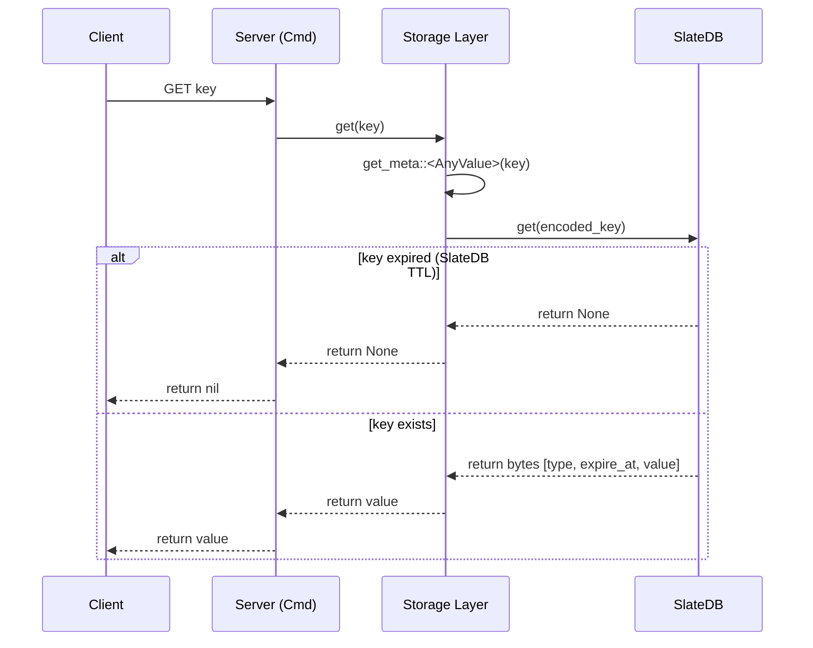

# TTL and Expiration Implementation Design

This document describes the design and implementation of Key Expiration (TTL) in Nimbis.

## 1. Overview

Nimbis implements Redis-compatible expiration logic. It combines SlateDB's native TTL features with high-level lazy expiration checks to ensure consistency and performance.

## 2. Storage Format

Expiration information is stored as part of the value's metadata in the `string_db` (which acts as the source of truth for all keys).

### Binary Layout
- **String**: `[Type Code 's'] [expire_time (u64 BE)] [raw_value]`
- **Hash Meta**: `[Type Code 'h'] [field_count (u64 BE)] [expire_time (u64 BE)]`

`expire_time` is an absolute timestamp in **milliseconds since epoch**. 
- `0`: No expiration (default).
- `>0`: Absolute expiry timestamp.

## 3. Implementation Mechanism

### SlateDB Native TTL
When `EXPIRE` is called, Nimbis sets a native SlateDB TTL (`PutOptions { ttl }`). SlateDB automatically returns `None` for expired keys on `get()` and reclaims space during compaction. There is no application-level lazy expiration check in `get_meta` — SlateDB's TTL is the sole mechanism.

### Collection Type Metadata
Collection types (Hash, List, Set, ZSet) use a "Master Expiration" pattern:
- The expiration is stored **ONLY** in the metadata value (in `string_db`).
- Individual members/fields/elements in their respective DBs do NOT store their own expiration.
- When SlateDB returns `None` for the metadata key (expired), the collection is treated as non-existent. Orphaned data records are cleaned up asynchronously by the `NimbisCompactionFilter`.

### Expirable Trait (Code Organization)
To avoid code duplication across different value types, the expiration logic is centralized in the `Expirable` trait defined in [`crates/storage/src/expirable.rs`](../crates/storage/src/expirable.rs).

#### Trait Definition
```rust
pub trait Expirable {
    fn expire_time(&self) -> u64;
    fn set_expire_time(&mut self, timestamp: u64);
    
    // Default implementations provided:
    fn is_expired(&self) -> bool { ... }
    fn expire_at(&mut self, timestamp: u64) { ... }
    fn expire_after(&mut self, duration: Duration) { ... }
    fn remaining_ttl(&self) -> Option<Duration> { ... }
}
```

#### Implementations
All data types store meta in `string_db` and implement `Expirable` and `MetaValue`:
- **StringValue**
- **HashMetaValue**, **ListMetaValue**, **SetMetaValue**, **ZSetMetaValue**
- **AnyValue**: An abstraction for any of the above.

#### Benefits
- **DRY Principle**: Expiration logic and metadata retrieval are defined once in `get_meta`.
- **Type Safety**: Trait-based dispatch ensures consistent behavior.
- **Unified Generic Operations**: `AnyValue` allows generic commands (`TTL`, `EXISTS`, etc.) to be implemented without type-specific boilerplate.

## 4. Key Logic Points

### Expiration Handling
When a read operation encounters an expired key:
1. SlateDB's native TTL returns `None` for the key automatically.
2. Orphaned data records (collection members under the expired version) are cleaned up asynchronously by the `NimbisCompactionFilter` during compaction.

### Unit Conversion
- **User Interface**: `EXPIRE` and `TTL` operate in **seconds**.
- **Internal Storage**: `expire_time` is stored in **milliseconds** for precision and compatibility with future `PEXPIRE` / `PTTL` commands.

### Return Values (TTL Command)
- `>0`: Remaining time in seconds.
- `-1`: Key exists but has no associated expiration.
- `-2`: Key does not exist (or has expired).

## 5. Summary of Flow


