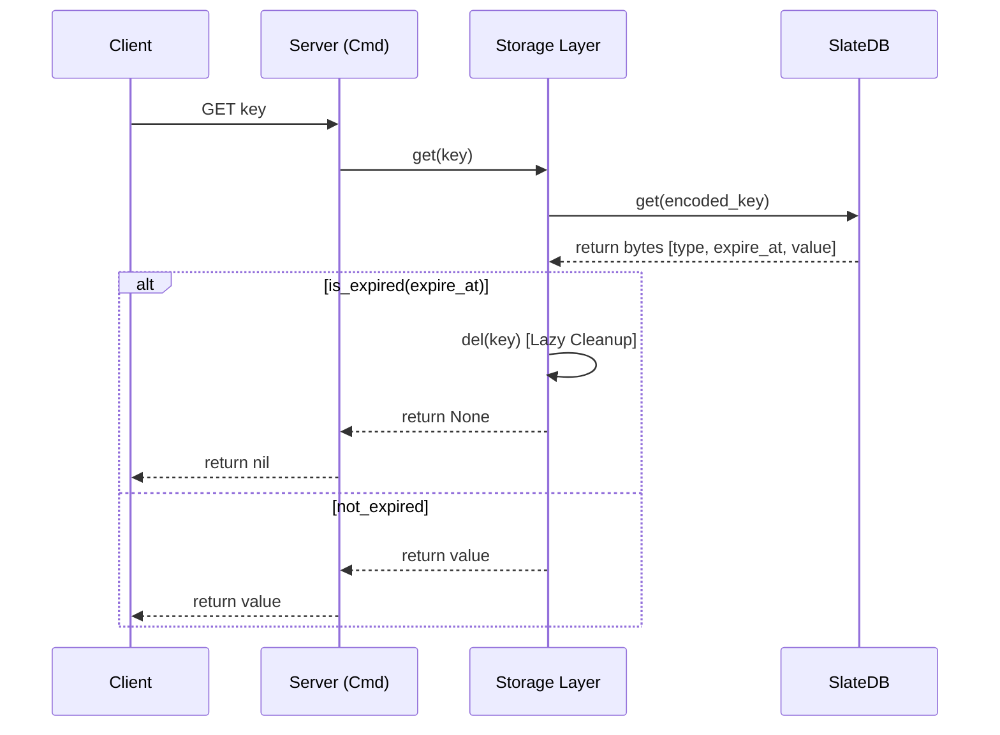

# TTL and Expiration Implementation Design

This document describes the design and implementation of Key Expiration (TTL) in Nimbis.

## 1. Overview

Nimbis implements Redis-compatible expiration logic. It combines SlateDB's native TTL features with high-level lazy expiration checks to ensure consistency and performance.

## 2. Storage Format

Expiration information is stored as part of the value's metadata in the `string_db` (which acts as the source of truth for all keys).

### Binary Layout
- **String**: `[Type Code 's'] [expire_time (u64 BE)] [raw_value]`
- **Hash Meta**: `[Type Code 'h'] [field_count (u64 BE)] [expire_time (u64 BE)]`

`expire_time` is an absolute timestamp in **milliseconds since epoch**. 
- `0`: No expiration (default).
- `>0`: Absolute expiry timestamp.

## 3. Implementation Mechanism

### Dual-Layer Expiration
1.  **Native SlateDB TTL**: When `EXPIRE` is called, Nimbis sets a native SlateDB TTL (`PutOptions { ttl }`). This allows SlateDB's compaction process to eventually reclaim space automatically.
2.  **Application-Level Lazy Expiration**: To satisfy Redis's strong consistency requirements, every read operation (`get`, `hget`, `exists`, `ttl`) checks the encoded `expire_time` against the current clock.

### Hash Type Specifics (Strict Metadata Check)
Hashes use a "Master Expiration" pattern:
- The expiration is stored **ONLY** in the `HashMetaValue` (in `string_db`).
- Individual fields in `hash_db` do NOT store their own expiration.
- **Strict Check**: Any operation on a hash (`HGET`, `HMGET`, `HGETALL`, `HLEN`) MUST first check the metadata in `string_db`. If the metadata is missing or expired, the hash is treated as non-existent, even if orphaned fields remain in the `hash_db`.

## 4. Key Logic Points

### Lazy Deletion
When a read operation detects an expired key:
1. Returns `None` (or empty) to the client immediately.
2. Triggers an asynchronous or immediate `Storage::del` to clean up the storage (including hash fields if applicable).

### Unit Conversion
- **User Interface**: `EXPIRE` and `TTL` operate in **seconds**.
- **Internal Storage**: `expire_time` is stored in **milliseconds** for precision and compatibility with future `PEXPIRE` / `PTTL` commands.

### Return Values (TTL Command)
- `>0`: Remaining time in seconds.
- `-1`: Key exists but has no associated expiration.
- `-2`: Key does not exist (or has expired).

## 5. Summary of Flow

